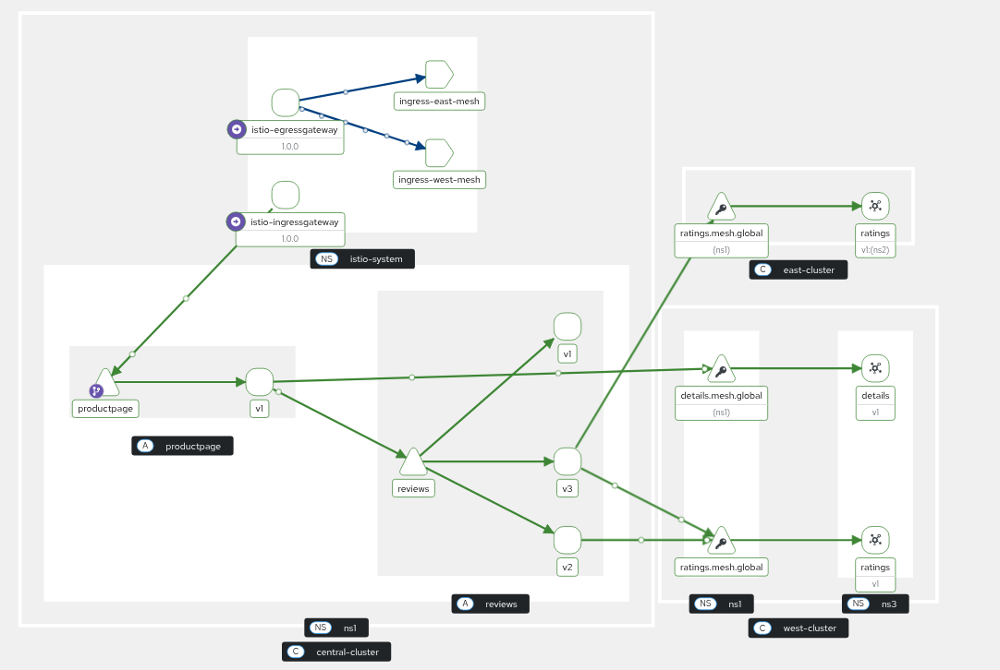

## Mesh federation with ArgoCD

### Prerequisites

1. Create 3 OCP clusters (east, west, central).
1. Install Service Mesh operator in all clusters.
1. Install GitOps operator in all clusters.
1. Install Kiali and User Workload Monitoring in the central cluster.

### Environment setup

1. Setup environment:

    ```shell
    export EAST_AUTH_PATH=
    export WEST_AUTH_PATH=
    export CENTRAL_AUTH_PATH=
    ```
    ```shell
    alias keast="KUBECONFIG=$EAST_AUTH_PATH/kubeconfig kubectl"
    alias istioctl-east="istioctl --kubeconfig=$EAST_AUTH_PATH/kubeconfig"
    alias kwest="KUBECONFIG=$WEST_AUTH_PATH/kubeconfig kubectl"
    alias istioctl-west="istioctl --kubeconfig=$WEST_AUTH_PATH/kubeconfig"
    alias kcent="KUBECONFIG=$CENTRAL_AUTH_PATH/kubeconfig kubectl"
    alias istioctl-cent="istioctl --kubeconfig=$CENTRAL_AUTH_PATH/kubeconfig"
    ```

   Generate certificates for Istio CA with common root:

   ```shell
   wget https://raw.githubusercontent.com/istio/istio/release-1.24/tools/certs/common.mk -O common.mk
   wget https://raw.githubusercontent.com/istio/istio/release-1.24/tools/certs/Makefile.selfsigned.mk -O Makefile.selfsigned.mk
   ```
   ```shell
   make -f Makefile.selfsigned.mk \
     ROOTCA_CN="Root CA" \
     ROOTCA_ORG=my-company.org \
     root-ca
   make -f Makefile.selfsigned.mk \
     INTERMEDIATE_CN="East Intermediate CA" \
     INTERMEDIATE_ORG=my-company.org \
     east-cacerts
   make -f Makefile.selfsigned.mk \
     INTERMEDIATE_CN="West Intermediate CA" \
     INTERMEDIATE_ORG=my-company.org \
     west-cacerts
   make -f Makefile.selfsigned.mk \
     INTERMEDIATE_CN="Central Intermediate CA" \
     INTERMEDIATE_ORG=my-company.org \
     central-cacerts
   make -f common.mk clean
   ```

### GitOps

   Apply permissive RBAC for GitOps operator (only for demo purposes):

   ```shell
   keast apply -f rbac.yaml
   kwest apply -f rbac.yaml
   kcent apply -f rbac.yaml
   ```

### Kubernetes Gateway API

   ```shell
   keast apply -f https://github.com/kubernetes-sigs/gateway-api/releases/download/v1.3.0/standard-install.yaml
   kwest apply -f https://github.com/kubernetes-sigs/gateway-api/releases/download/v1.3.0/standard-install.yaml
   kcent apply -f https://github.com/kubernetes-sigs/gateway-api/releases/download/v1.3.0/standard-install.yaml
   ```

### Service Mesh

   ```shell
   # east
   keast create namespace istio-cni
   keast apply -f istio-cni.yaml
   # west
   kwest create namespace istio-cni
   kwest apply -f istio-cni.yaml
   # central
   kcent create namespace istio-cni
   kcent apply -f istio-cni.yaml
   ```
   ```shell
   # east
   keast create namespace istio-system
   keast create secret generic cacerts -n istio-system \
     --from-file=root-cert.pem=east/root-cert.pem \
     --from-file=ca-cert.pem=east/ca-cert.pem \
     --from-file=ca-key.pem=east/ca-key.pem \
     --from-file=cert-chain.pem=east/cert-chain.pem
   keast apply -f east/istio.yaml
   # west
   kwest create namespace istio-system
   kwest create secret generic cacerts -n istio-system \
     --from-file=root-cert.pem=west/root-cert.pem \
     --from-file=ca-cert.pem=west/ca-cert.pem \
     --from-file=ca-key.pem=west/ca-key.pem \
     --from-file=cert-chain.pem=west/cert-chain.pem
   kwest apply -f west/istio.yaml
   # central
   kcent create namespace istio-system
   kcent create secret generic cacerts -n istio-system \
     --from-file=root-cert.pem=central/root-cert.pem \
     --from-file=ca-cert.pem=central/ca-cert.pem \
     --from-file=ca-key.pem=central/ca-key.pem \
     --from-file=cert-chain.pem=central/cert-chain.pem
   kcent apply -f central/istio.yaml
   ```

### OpenShift Monitoring

   ```shell
   kcent apply -f central/user-workload-monitoring.yaml
   ```

### Kiali

   ```shell
   kcent apply -f central/service-monitor.yaml -n istio-system
   kcent apply -f central/pod-monitor.yaml -n istio-system
   kcent apply -f central/kiali.yaml
   ```

## Demo

### East cluster

1. Deploy and export `ratings` service:

   ```shell
   keast create namespace east-apps
   keast label namespace east-apps istio-injection=enabled
   keast apply -n east-apps -l account=ratings -f https://raw.githubusercontent.com/istio/istio/refs/heads/release-1.26/samples/bookinfo/platform/kube/bookinfo.yaml
   keast apply -n east-apps -l app=ratings -f https://raw.githubusercontent.com/istio/istio/refs/heads/release-1.26/samples/bookinfo/platform/kube/bookinfo.yaml
   keast apply -f east/istio-eastwestgateway.yaml
   keast apply -f east/mesh-federation.yaml
   keast apply -f east/bookinfo-federation.yaml
   ```

### West cluster

1. Deploy and export `details` and `ratings` services:

   ```shell
   kwest create namespace west-apps
   kwest label namespace west-apps istio-injection=enabled
   kwest apply -n west-apps -l account=details -f https://raw.githubusercontent.com/istio/istio/refs/heads/release-1.26/samples/bookinfo/platform/kube/bookinfo.yaml
   kwest apply -n west-apps -l app=details -f https://raw.githubusercontent.com/istio/istio/refs/heads/release-1.26/samples/bookinfo/platform/kube/bookinfo.yaml
   kwest apply -n west-apps -l account=ratings -f https://raw.githubusercontent.com/istio/istio/refs/heads/release-1.26/samples/bookinfo/platform/kube/bookinfo.yaml
   kwest apply -n west-apps -l app=ratings -f https://raw.githubusercontent.com/istio/istio/refs/heads/release-1.26/samples/bookinfo/platform/kube/bookinfo.yaml
   kwest apply -f west/istio-eastwestgateway.yaml
   kwest apply -f west/mesh-federation.yaml
   kwest apply -f west/bookinfo-federation.yaml
   ```

### Central cluster

This cluster will import services from east and west clusters.

1. Deploy ingress and egress gateways:

   ```shell
   kcent apply -f central/istio-egressgateway.yaml
   kcent apply -f central/istio-ingressgateway.yaml
   ```

1. Deploy productpage, details and reviews:

   ```shell
   kcent create namespace central-apps
   kcent label namespace central-apps istio-injection=enabled
   kcent apply -f https://raw.githubusercontent.com/istio/istio/refs/heads/release-1.26/samples/bookinfo/networking/bookinfo-gateway.yaml -n central-apps
   kcent apply -l app=productpage -f https://raw.githubusercontent.com/istio/istio/refs/heads/release-1.26/samples/bookinfo/platform/kube/bookinfo.yaml -n central-apps
   kcent apply -l account=productpage -f https://raw.githubusercontent.com/istio/istio/refs/heads/release-1.26/samples/bookinfo/platform/kube/bookinfo.yaml -n central-apps
   kcent apply -l app=reviews -f https://raw.githubusercontent.com/istio/istio/refs/heads/release-1.26/samples/bookinfo/platform/kube/bookinfo.yaml -n central-apps
   kcent apply -l account=reviews -f https://raw.githubusercontent.com/istio/istio/refs/heads/release-1.26/samples/bookinfo/platform/kube/bookinfo.yaml -n central-apps
   kcent apply -l account=details -f https://raw.githubusercontent.com/istio/istio/refs/heads/release-1.26/samples/bookinfo/platform/kube/bookinfo.yaml -n central-apps
   kcent apply -l app=details -f https://raw.githubusercontent.com/istio/istio/refs/heads/release-1.26/samples/bookinfo/platform/kube/bookinfo.yaml -n central-apps
   kcent apply -f central/pod-monitor.yaml -n central-apps
   ```
   ```shell
   kcent apply -f https://raw.githubusercontent.com/istio/istio/refs/heads/release-1.26/samples/bookinfo/networking/bookinfo-gateway.yaml -n central-apps
   kcent apply -n central-apps -f - <<EOF
   apiVersion: networking.istio.io/v1
   kind: Gateway
   metadata:
     name: bookinfo-gateway
   spec:
     selector:
       istio: ingressgateway
     servers:
     - port:
         number: 80
         name: http
         protocol: HTTP
       hosts:
       - "*"
   EOF
   ```

1. Enable mesh federation and import remote services:

   ```shell
   kcent apply -f central/mesh-federation.yaml
   kcent apply -f central/bookinfo-federation.yaml
   ```

1. Update productpage to consume imported ratings:

   ```shell
   kcent patch deployment productpage-v1 -n central-apps \
     --type='strategic' \
     -p='{
       "spec": {
         "template": {
           "spec": {
             "containers": [
               {
                 "name": "productpage",
                 "env": [
                   {
                     "name": "DETAILS_HOSTNAME",
                     "value": "details.mesh.global"
                   }
                 ]
               }
             ]
           }
         }
       }
     }'
   ```
   ```shell
   kcent patch deployment reviews-v2 -n central-apps \
     --type='strategic' \
     -p='{
       "spec": {
         "template": {
           "spec": {
             "containers": [
               {
                 "name": "reviews",
                 "env": [
                   {
                     "name": "RATINGS_HOSTNAME",
                     "value": "ratings.mesh.global"
                   }
                 ]
               }
             ]
           }
         }
       }
     }'
   ```
   ```shell
   kcent patch deployment reviews-v3 -n central-apps \
     --type='strategic' \
     -p='{
       "spec": {
         "template": {
           "spec": {
             "containers": [
               {
                 "name": "reviews",
                 "env": [
                   {
                     "name": "RATINGS_HOSTNAME",
                     "value": "ratings.mesh.global"
                   }
                 ]
               }
             ]
           }
         }
       }
     }'
   ```

1. Send requests in a loop:

   ```shell
   HOST=$(kcent get routes istio-ingressgateway -n istio-system -o jsonpath='{.spec.host}')
   while true; do curl -v http://$HOST/productpage > /dev/null; sleep 2; done
   ```

#### Kiali view


